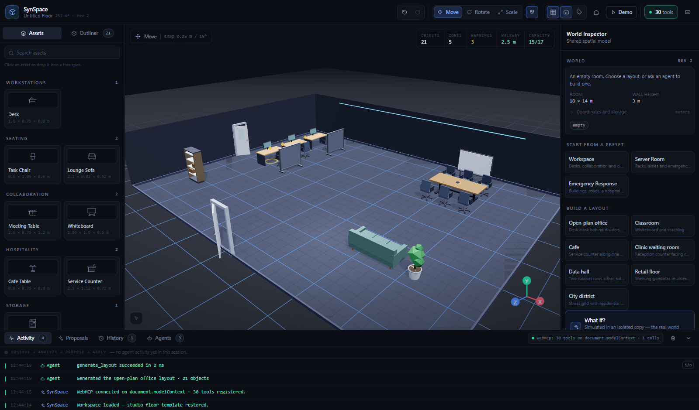
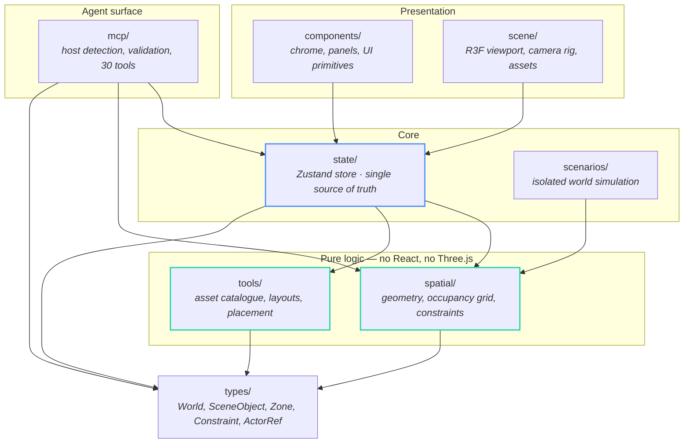
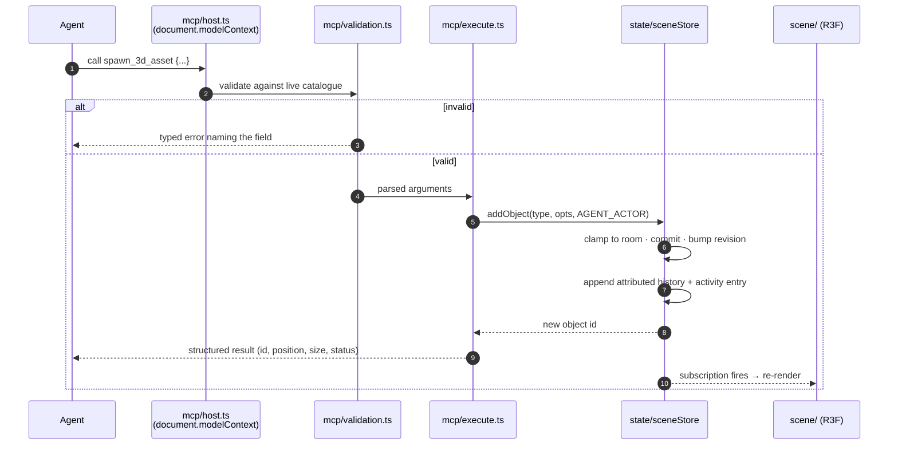
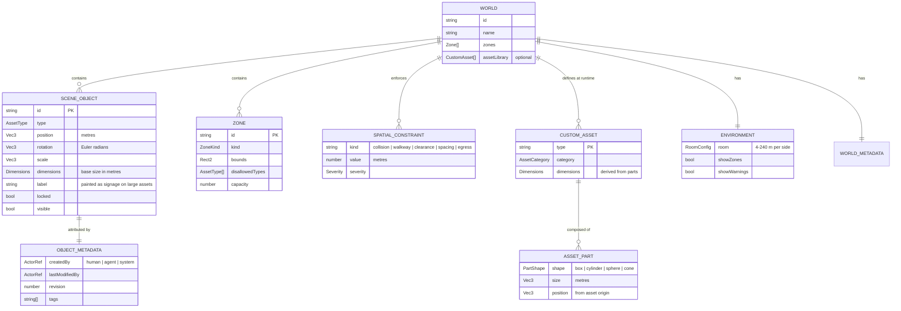
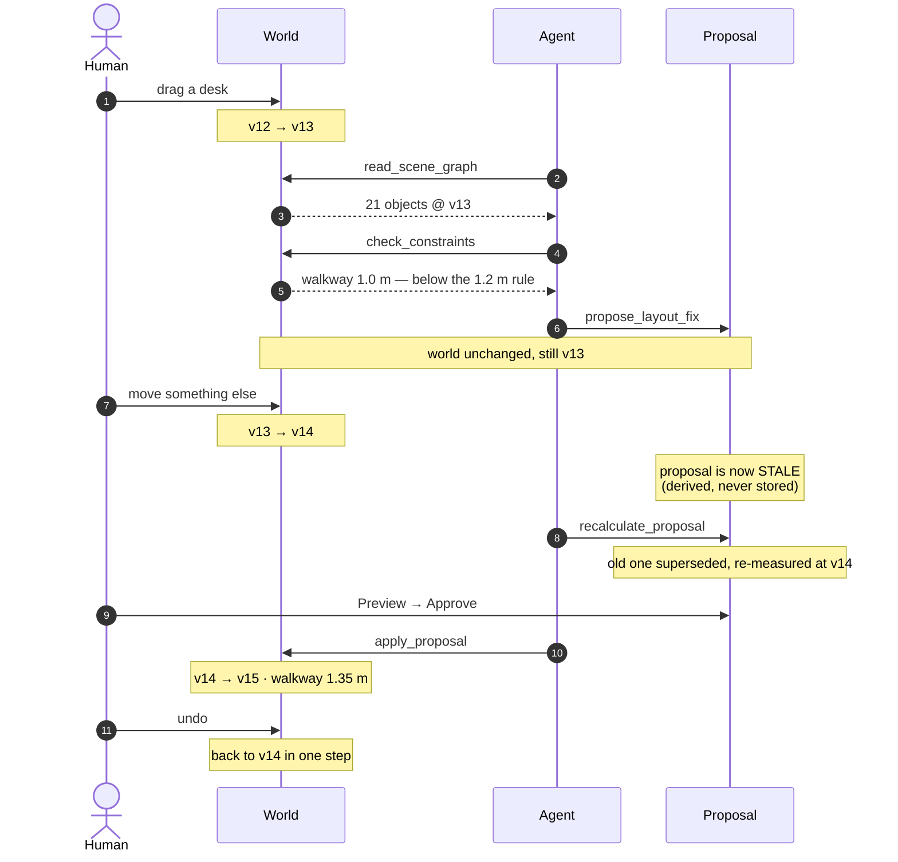
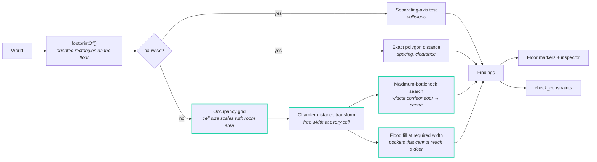
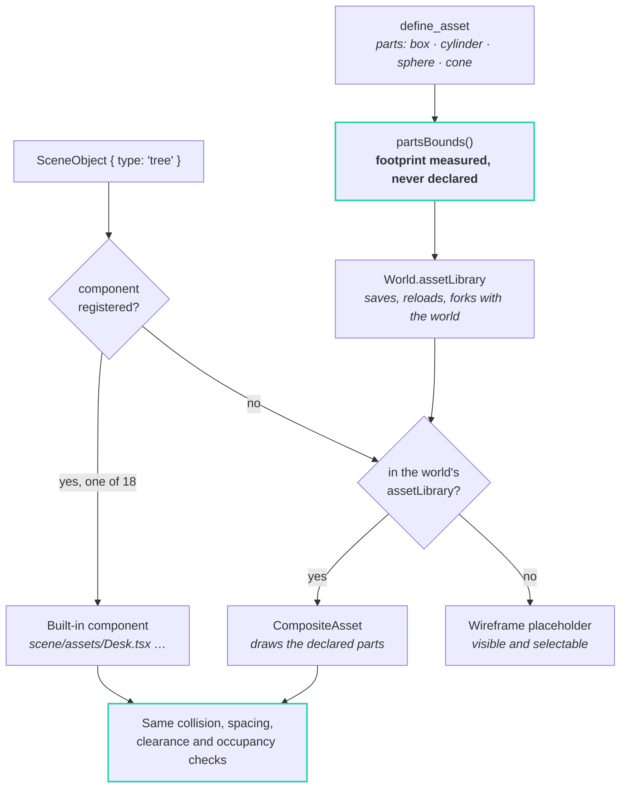
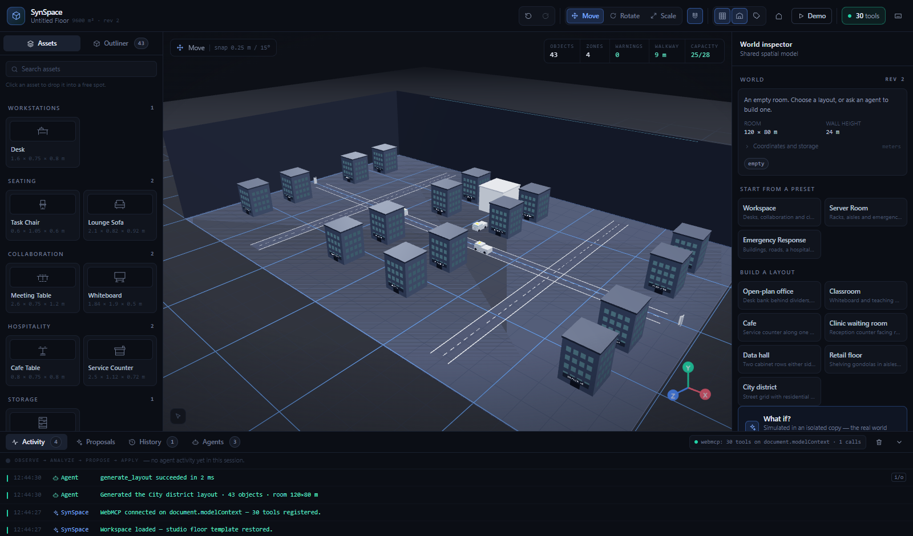
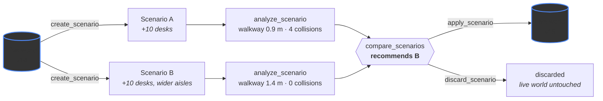

# SynSpace

**One world. Two minds.** An agent-native spatial workspace where a person and
an AI agent inspect, simulate and shape the same 3D world.

A human edits the room directly. A [WebMCP](https://github.com/webmachinelearning/webmcp)
agent reads that same room through structured tools, reasons about it against
real spatial constraints, and proposes changes back. Both write to one document,
and every change is attributed, logged and undoable — so an agent's work is as
reviewable as a person's.



---

## Contents

- [Why this exists](#why-this-exists)
- [Quick start](#quick-start)
- [Architecture](#architecture)
- [The world document](#the-world-document)
- [The collaboration loop](#the-collaboration-loop)
- [Spatial reasoning](#spatial-reasoning)
- [The WebMCP tool surface](#the-webmcp-tool-surface)
- [Assets are data, not code](#assets-are-data-not-code)
- [Worlds, presets and layouts](#worlds-presets-and-layouts)
- [What-if simulation](#what-if-simulation)
- [Interaction and UI](#interaction-and-ui)
- [Verification](#verification)
- [Performance](#performance)
- [Not built yet](#not-built-yet)

---

## Why this exists

A normal website exposes pixels and a DOM. An agent has to guess what a page
means, then act by clicking things. SynSpace exposes a **structured spatial
world** instead: rooms, objects, zones, constraints and measurable distances,
reachable through typed tools.

That changes what an agent can be asked to do. Not *"click the button at
(840, 210)"* but *"the walkway is 1.0 m and fire code wants 1.2 m — find the
smallest set of moves that fixes it, and show me the before and after."*

Three properties make it work:

| Property | What it means |
| --- | --- |
| **Shared state** | The agent and the UI read the same document. Neither has a private copy that can drift. |
| **Deterministic reasoning** | The same world always produces the same findings, so a before/after comparison is meaningful rather than anecdotal. |
| **Human-gated writes** | An agent can read, measure and propose freely. Applying a proposal requires an explicit human approval, and a stale proposal is refused. |

---

## Quick start

```bash
npm install
npm run dev         # http://localhost:5173
npm test            # 58 deterministic spatial, scenario + tool checks
npm run typecheck
npm run build       # tsc -b && vite build
npm run preview
```

**Stack** — React 19 · Vite 7 · TypeScript 5.7 (strict) · Tailwind CSS 4 ·
Three.js r180 · React Three Fiber 9 · Drei 10 · Zustand 5 · Vitest

> **No browser ships WebMCP enabled today.** A plain load correctly reports
> `webmcp: unavailable`. See [Turning WebMCP on](#turning-webmcp-on) for the
> polyfill route.

---

## Architecture

Five layers, one direction of dependency. The two layers that do the thinking —
`spatial/` and `mcp/` — import neither React nor Three.js, so the renderer could
be replaced without touching a single tool definition.



**Nothing reads `scene/`.** The renderer is a leaf. That is what makes the same
world addressable by a person through a gizmo and by an agent through a tool
call, with no second code path.

### Four rules that hold it together

1. **One document is the source of truth.** `state.scene` holds objects,
   environment, zones and constraints together. Nothing renders that is not in it.
2. **No scene data lives in a rendering component.** `SceneObjects` maps over
   `useSceneObjects()`; every starter world is data in `tools/`.
3. **Derived facts are never stored.** Zone membership, neighbours, bounds and
   proposal staleness are computed on read, so they cannot drift out of sync
   with the transforms they describe.
4. **The state layer knows nothing about React or Three.js.** `state/sceneApi.ts`
   is a plain, result-returning facade — the seam the tools register against, so
   `document.modelContext` never touches the renderer.

### How a tool call reaches the screen

Every agent action and every human action converge on the same store mutation.
There is no "agent path" that bypasses validation, history or attribution.



---

## The world document

One `World` object is the whole state. Everything else is derived from it.



Logical measurements are **metres in a right-handed system**. The floor centre
is `(0, 0, 0)`, `+Y` is up, the room spans `-width/2 … +width/2` on X and
`-depth/2 … +depth/2` on Z. Yaw `0` faces `+Z`; yaw `+90°` faces `+X`.

### History

Undo is snapshot-based: each entry holds the whole `World` before and after.
Because updates are immutable, unchanged objects are **shared by reference**
between snapshots — a snapshot costs one array and a few pointers, far cheaper
and far less bug-prone than maintaining an inverse for every action. Entries cap
at 60 and record the actor, so the History tab shows at a glance which changes
were a person's and which were an agent's.

A committed change is classified by *diffing* the object, not by inspecting the
patch: the gizmo always writes position, rotation and scale together, so only
the diff can tell a translate drag from a rotate drag.

The revision counter is derived from the document that was already live, never
from an incoming one. Whole worlds get installed here — a scenario world has
been edited independently and carries a counter of its own — and inheriting it
would make one apply look like a dozen changes, breaking the staleness detection
that stands between an agent and overwriting newer human work.

---

## The collaboration loop

Observe → Analyze → Propose → **human approval** → Apply. The gate is the point:
an agent can compute anything, but it cannot change the world unilaterally.



A proposal carries a title, a one-line summary, explanation lines, the operations
it would run, the objects it affects, the objects it deliberately *preserved*,
measurable expected benefits (walkway width, collisions, blocked exits, free
area) and the full constraint picture before and after. The console shows it with
**Preview**, **Approve** and **Reject**.

**Staleness is derived, never stored.** A proposal records the world revision it
was computed against; if the live world has moved on, the proposal reads as stale
the moment it is looked at. `apply_proposal` refuses a stale proposal outright
rather than silently applying measurements taken against a world that no longer
exists.

**Human override wins.** `set_object_fixed` pins an object; the agent must then
re-read and route around it rather than reusing what it saw before.

---

## Spatial reasoning

`spatial/` is deterministic by construction — same world, same findings, every
time. That is what makes `optimize_layout`'s before/after comparison meaningful
rather than anecdotal.



Walkway and egress questions are **not pairwise**, so the floor is rasterised
into an occupancy grid and routes are evaluated with a maximum-bottleneck
("widest path") search: *what is the widest corridor connecting the door to the
middle of the room?* Egress flood-fills the free space at the required width and
reports any pocket of floor that cannot reach a door.

The rules encode real-world intent, not naive geometry:

- Chairs tucked under desks are **expected**, not collisions.
- Doors are **openings**, not obstacles.
- Roads are **surfaces** — you drive on them, so they are exempt from collision
  and spacing.
- Grid resolution **scales with room area** (0.25 m in a classroom, coarser in a
  city district). At a fixed 0.25 m, a 120 × 80 m world is a quarter of a
  million cells and the route search crawls; scaling keeps a full constraint
  pass around 300 ms at city scale while leaving small rooms bit-identical.

---

## The WebMCP tool surface

**30 tools**, grouped by what they let an agent do. Every one validates its
arguments strictly and returns a structured result — never prose an agent has to
parse.

### Read and measure

| Tool | Purpose |
| --- | --- |
| `read_scene_graph` | Room, every object, zones, constraints, environment — always live state |
| `inspect_world` | Structured world view: bounds, zone occupancy, coordinate system |
| `query_spatial_relationships` | `inside`, `near`, `adjacent_to`, `blocks`, `connected_to` for one object |
| `check_constraints` | Collisions, spacing, walkway width, clearance, egress — with severities |
| `list_asset_types` | The whole live catalogue, built-in and runtime-defined |
| `list_layouts` | Buildable arrangements, and the room size each one needs |
| `list_proposals` | Open proposals with live staleness |

### Change the world

| Tool | Purpose |
| --- | --- |
| `spawn_3d_asset` | Place an asset; optionally size it in metres and label it |
| `move_3d_asset` / `rotate_3d_asset` / `resize_3d_asset` | Absolute transforms; resize takes metres |
| `delete_3d_asset` | Remove one object |
| `resize_world` | Resize the room itself, 4–240 m per side |
| `change_environment_variables` | Lighting, grid, overlays, snapping |
| `generate_layout` | Rebuild the world as a named kind of space |
| `optimize_layout` | Deterministic improvement pass with a stated strategy |
| `clear_canvas` | Empty the world |

### Extend the catalogue

| Tool | Purpose |
| --- | --- |
| `define_asset` | Compose a **new kind of asset** from primitives — no code change |
| `remove_asset_type` | Remove a runtime-defined kind (refused while it is in use) |

### Simulate without touching anything

| Tool | Purpose |
| --- | --- |
| `create_scenario` | Fork the world into an isolated copy |
| `modify_scenario` | Apply operations inside the fork only |
| `analyze_scenario` | Metrics for the fork |
| `compare_scenarios` | Side-by-side with a recommendation |
| `apply_scenario` / `discard_scenario` | Promote to the real world, or throw away |

### Propose, and wait for a human

| Tool | Purpose |
| --- | --- |
| `create_proposal` | Propose an explicit set of operations |
| `propose_layout_fix` | Propose a fix for detected violations, with measured benefits |
| `recalculate_proposal` | Re-measure against the current world, superseding the old one |
| `apply_proposal` | Apply — **only** after human approval, **only** if not stale |
| `set_object_fixed` | Human override: pin an object the agent must route around |

### Turning WebMCP on

No browser ships WebMCP enabled today. Chrome 152 does **not** expose it even
with `--enable-features=WebMCP` — the feature is not compiled into stable
builds, so the flag is a no-op. A plain load reports `webmcp: unavailable`,
which is correct behaviour rather than a fault.

To exercise the real tool surface locally:

```bash
npm run dev
# then open
http://localhost:5173/?webmcp=1
```

That loads [`@mcp-b/global`](https://www.npmjs.com/package/@mcp-b/global), the
W3C WebMCP polyfill, and SynSpace registers against it with **no code path
changed**. The status line reads `document.modelContext (polyfill)` — it never
claims native support. The preference sticks; `?webmcp=0` clears it.

Guards keep it out of the product: devDependency, imported dynamically, behind
`import.meta.env.DEV`, inert unless requested. The production bundle contains no
trace of it.

```js
await document.modelContext.getTools()             // 30 tools
await navigator.modelContextTesting.executeTool('read_scene_graph', '{}')
```

Registration uses `document.modelContext.registerTool` (`navigator.modelContext`,
now deprecated in the spec, and `window.modelContext` are also checked).
Teardown uses the `AbortSignal` the standard passes to `registerTool` —
`ModelContext` has no `unregisterTool`.

> **Note on chat clients.** WebMCP transports are *browser-local*. A
> chat.openai.com conversation in another tab cannot reach this page's tools; an
> agentic browser (ChatGPT Atlas, the MCP-B extension) can.

---

## Assets are data, not code

A built-in asset costs three edits — a component, a catalogue entry, a union
member — which makes "add a tree" a rebuild. So an agent can define new kinds
**at runtime** instead, from primitives, and they become first-class immediately.



The load-bearing decision: **a custom asset's dimensions are derived from its
parts**, so it cannot lie about the space it occupies. Everything downstream —
collisions, walkway width, the occupancy grid — reads those dimensions, and they
have to match what is actually drawn.

Two consequences worth knowing:

- Tool schemas **cannot freeze the asset list into an `enum`**. A schema is
  captured once at registration; an enum there would reject the very kind an
  agent had just defined. Types are validated against the live catalogue instead,
  with an error that points at `define_asset`.
- Every instance is **resizable in metres**, so one `building` model covers a
  corner shop, a warehouse and a 42 m tower. The fixed kit plus sizing covers far
  more than the kit alone.

The 18 built-in kinds span workstations, seating, collaboration, storage,
hospitality, infrastructure, structure and urban fabric — desks and chairs
through to buildings, hospitals, roads and vehicles. Large assets paint their
label onto their own geometry, so a hospital reads as a hospital from across the
room.

---

## Worlds, presets and layouts

Three different scopes, deliberately kept distinct:

| | Scope | Room size | Use |
| --- | --- | --- | --- |
| **Preset** | Replaces the whole world | Set by the preset | Start from a prepared scenario |
| **Layout** | Replaces objects and zones | Sized *to the layout* | "Make this a classroom" |
| **Spawn** | One object | Unchanged | Precise placement |

**Presets** — Workspace (18 × 14 m), Server Room, Emergency Response (60 × 44 m).

**Layouts** — open-plan office, classroom, cafe, clinic waiting room, data hall,
retail floor, **city district**. Each is a deterministic generator that reads the
room and returns objects plus zones.

A layout **declares the ground it needs** and the room is resized to suit. A
classroom and a city district are not the same size, and squeezing one into the
other's floor plan produces nonsense. Ask for a city and you get 120 × 80 m,
43 objects, a street grid with named blocks, a hospital and traffic — with zero
constraint violations.



---

## What-if simulation

`create_scenario` forks the world into an isolated copy. Operations inside a
scenario **cannot** touch the live world — verified by test, not by convention:
the world revision is identical before and after a full simulate-and-compare
cycle.



---

## Interaction and UI

```
┌──────────────────────────────────────────────────────────────────┐
│ Header · identity · document · transform tools · view · WebMCP   │
├──────────┬────────────────────────────────────────┬──────────────┤
│ Assets / │                                        │  Inspector   │
│ Outliner │            3D viewport                 │  selection   │
│          │        + world-state overlay           │  or world    │
├──────────┴────────────────────────────────────────┴──────────────┤
│ Console · Activity + tool log · Proposals · History · Agents     │
└──────────────────────────────────────────────────────────────────┘
```

Click to select, drag the gizmo to transform, `W`/`E`/`R` to switch mode, `X`
for snapping, `L` for labels, `Home` to reframe, `Esc` to clear. Undo/redo is
`Ctrl+Z` / `Ctrl+Shift+Z`.

The interface is ranked rather than flattened: what you need while working stays
on screen, and reference material — coordinate conventions, storage behaviour,
navigation keys — sits one click away behind a disclosure. Nothing is removed.

The docks are fixed-width, which on a narrow surface leaves nothing for the world
itself. Since the world *is* the product, the docks give way first: they become
overlay drawers below their breakpoints, and the header exposes toggles.

The world is saved to `localStorage` on a debounced write, so a refresh brings
it back. **Start fresh** in the outliner clears both the world and the saved
copy. Undo history and scenarios are session work and are deliberately *not*
restored — reviving an undo stack whose snapshots reference a page that no longer
exists would be worse than starting clean.

---

## Verification

```bash
npm test        # 58 checks across 7 suites
```

| Suite | Covers |
| --- | --- |
| `world` | Geometry, zones, relationships, boundaries, constraint evaluation |
| `scenario` | Isolation — a simulated world never mutates the live one |
| `proposal` | Staleness detection, approval gating, override |
| `determinism` | Same world in, same findings out |
| `persistence` | Save, restore, schema rejection, start-fresh |
| `dynamic-world` | Layout-driven room sizing, city generation, occupancy scaling |
| `custom-assets` | Runtime asset definition, derived footprints, open schemas |

The tool surface is additionally exercised end-to-end in a real browser against
`@mcp-b/global` — the actual W3C polyfill, not a hand-written stub. That is what
caught two genuine host-adapter bugs: teardown calling a `unregisterTool` method
that does not exist in the spec, and a rejected `registerTool` promise being
reported as a successful registration.

---

## Performance

- The shadow map is **static**, invalidated only when the world changes, rather
  than re-rendered every frame.
- Occupancy grid resolution scales with room area, keeping a full constraint pass
  around 300 ms at city scale.
- `AdaptiveDpr` lowers resolution during camera movement.
- Persistence writes are debounced at 400 ms with a `pagehide` flush, since a
  gizmo drag commits a new document on every frame.

Software rendering (SwiftShader, CI) is fill-rate bound and will look slow — that
is the renderer, not the scene: frame rate there scales with pixel count, not
object count.

---

## Not built yet

Honest scope. These are absent by choice, not by oversight:

- **Multi-user presence.** One browser, one person. The actor model is built for
  more, but there is no transport.
- **Server persistence.** `localStorage` only; nothing leaves the browser.
- **Native WebMCP.** No browser ships it enabled; the polyfill route is the only
  way to exercise the tools today.
- **Freeform geometry.** Custom assets compose primitives. There is no mesh
  import, and no curved or extruded geometry.
- **Continuous collision during drag.** Constraints are evaluated on commit, not
  per-frame.
